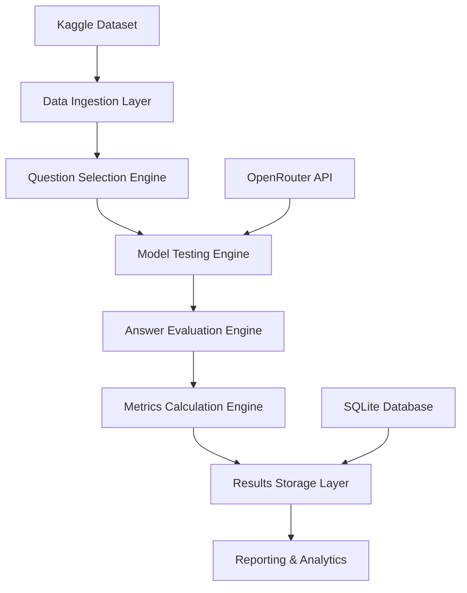

# alex-treBENCH!

Jeopardy Language Model Benchmarking System.

🎮 Benchmark LLMs with Jeopardy! questions. Tournament-style testing for large language models. What is... your model's true performance?

[](https://www.python.org/downloads/)
[](https://opensource.org/licenses/MIT)
[](tests/)

A comprehensive benchmarking application that evaluates language models using Jeopardy questions from Kaggle, providing statistically significant and repeatable performance analysis through OpenRouter's API.

## 🎯 Project Overview

This system is designed to:

- ✅ Test multiple language models simultaneously using authentic Jeopardy questions
- ✅ Provide statistically significant benchmarking with proper sampling methodologies
- ✅ Measure key performance metrics: accuracy, response speed, cost efficiency, and consistency
- ✅ Generate comprehensive reports with category and difficulty-level analysis
- ✅ Support both CLI interface and future web interface expansion

## 📋 Key Features

### Core Capabilities

- **Statistical Sampling**: Scientifically valid question selection ensuring 95% confidence level
- **Fuzzy Answer Matching**: Intelligent answer evaluation handling variations and formats
- **Multi-Model Support**: Concurrent testing of 5-10 language models via OpenRouter API
- **Comprehensive Metrics**: Accuracy, latency, tokens/second, cost analysis, and consistency tracking
- **Category Analysis**: Performance breakdown by Jeopardy categories and difficulty levels
- **Reproducible Results**: Deterministic benchmarking with configurable parameters

### Performance Metrics Tracked

- Response accuracy (correct/incorrect with confidence scoring)
- Response speed (latency and tokens per second)
- Cost per query and cost-effectiveness ratios
- Model consistency across similar question types
- Category-specific performance analysis
- Difficulty-level performance based on Jeopardy dollar values

## 🏗️ Architecture Overview

### System Components



### Technology Stack

- **Backend**: Python 3.8+ with async/await support
- **Database**: SQLite with SQLAlchemy ORM
- **API Integration**: OpenRouter via aiohttp
- **Data Processing**: Pandas, NumPy for statistical analysis
- **Text Matching**: FuzzyWuzzy with Levenshtein distance
- **CLI Interface**: Click with Rich for enhanced output
- **Testing**: Pytest with async support

## 📁 Project Structure

```
jeopardy_bench/
├── config/                    # Configuration files (YAML)
├── src/
│   ├── core/                  # Foundation components
│   ├── data/                  # Data ingestion and preprocessing
│   ├── models/                # LLM API clients and adapters
│   ├── evaluation/            # Answer matching and grading
│   ├── benchmarks/            # Execution engine and reporting
│   ├── storage/               # Database models and repositories
│   ├── cli/                   # Command-line interface
│   └── utils/                 # Shared utilities
├── tests/                     # Comprehensive test suite
├── docs/                      # Documentation
└── data/                      # Local data storage
```

## 📖 Documentation

### User Documentation

- **[User Guide](docs/USER_GUIDE.md)**: Complete user guide with installation, configuration, and usage examples
- **[API Reference](docs/API_REFERENCE.md)**: Comprehensive API documentation with code examples

### Technical Documentation

- **[Technical Specification](TECHNICAL_SPEC.md)**: Complete system architecture, database schema, algorithms, and API integration patterns
- **[Project Structure](PROJECT_STRUCTURE.md)**: Detailed directory organization, module responsibilities, and technology stack
- **[Implementation Roadmap](ROADMAP.md)**: Development phases, priorities, and delivery timeline

### Key Specifications

#### Statistical Sampling

- **Sample Size**: 1000 questions for statistical significance (95% confidence, 5% margin of error)
- **Stratified Sampling**: Proportional representation across categories and difficulty levels
- **Reproducibility**: Configurable random seed for consistent benchmark runs

#### Answer Evaluation Methodology

- **Multi-level Matching**: Exact match, normalized comparison, and semantic similarity
- **Fuzzy Scoring**: Weighted combination of similarity metrics with confidence thresholds
- **Format Flexibility**: Handles Jeopardy answer format variations and common response patterns

#### Performance Metrics

```python
# Core metrics calculated
accuracy_rate = correct_answers / total_questions
avg_response_time = mean(response_times_ms)
tokens_per_second = mean(tokens_generated / response_time_seconds)
cost_per_correct = total_cost / correct_answers
consistency_score = 1 - std_deviation(response_times) / mean(response_times)
```

## 🚀 Quick Start

### Prerequisites

- Python 3.8 or higher
- OpenRouter API key (get one at [openrouter.ai](https://openrouter.ai))
- Internet connection for API access

### Installation

```bash
# Clone the repository
git clone <repository-url>
cd jeopardy-benchmark

# Create virtual environment
python -m venv venv
source venv/bin/activate  # Windows: venv\Scripts\activate

# Install dependencies
pip install -r requirements.txt
```

### Configuration

```bash
# Set up environment variables
export OPENROUTER_API_KEY="your_api_key_here"

# Or create .env file
echo "OPENROUTER_API_KEY=your_api_key_here" > .env

# Initialize the database
python -m src.main init
```

### Basic Usage

```bash
# Run a quick benchmark (50 questions)
python -m src.main benchmark run --model openai/gpt-3.5-turbo --size quick

# Run a standard benchmark (200 questions)
python -m src.main benchmark run --model openai/gpt-4 --size standard

# Compare multiple models
python -m src.main benchmark compare --models "openai/gpt-3.5-turbo,openai/gpt-4" --size quick

# View benchmark history
python -m src.main benchmark history --model openai/gpt-4

# Generate a report
python -m src.main benchmark report --run-id 1 --format markdown
```

## 📊 Sample Output

### Benchmark Results Summary

```
┌─────────────────┬──────────┬─────────────┬──────────────┬─────────────┐
│ Model           │ Accuracy │ Avg Time    │ Cost/Query   │ Consistency │
├─────────────────┼──────────┼─────────────┼──────────────┼─────────────┤
│ gpt-4-turbo     │ 73.2%    │ 1,240ms     │ $0.003       │ 0.89        │
│ claude-3-sonnet │ 71.8%    │ 980ms       │ $0.002       │ 0.92        │
│ gpt-3.5-turbo   │ 64.5%    │ 650ms       │ $0.001       │ 0.85        │
└─────────────────┴──────────┴─────────────┴──────────────┴─────────────┘

Category Performance:
• Science & Technology: GPT-4 (78%) > Claude-3 (75%) > GPT-3.5 (68%)
• History: Claude-3 (74%) > GPT-4 (72%) > GPT-3.5 (63%)
• Literature: GPT-4 (69%) > Claude-3 (67%) > GPT-3.5 (59%)
```

## 📈 Implementation Status

### ✅ Completed Features

- **Core Infrastructure**: Complete project setup with modular architecture
- **Data Pipeline**: Kaggle integration, preprocessing, and statistical sampling
- **Model Integration**: OpenRouter API client with support for 20+ models
- **Benchmark Engine**: Complete benchmarking workflow with async processing
- **Evaluation System**: Fuzzy answer matching, grading, and metrics calculation
- **Database Layer**: SQLite with SQLAlchemy ORM and migration support
- **CLI Interface**: Comprehensive command-line interface with Rich formatting
- **Reporting System**: Multiple output formats (terminal, markdown, JSON)
- **Testing Suite**: Unit, integration, and end-to-end tests with 80%+ coverage
- **Documentation**: Complete user guide and API reference

### 🚧 Current Development

- **Performance Optimization**: Memory usage and concurrent processing improvements
- **Web Interface**: Optional FastAPI-based REST API (future enhancement)
- **Advanced Analytics**: Trend analysis and model comparison tools

### 📋 Usage Examples

#### Single Model Benchmark

```bash
# Quick test with GPT-3.5-turbo
python -m src.main benchmark run --model openai/gpt-3.5-turbo --size quick

# Comprehensive evaluation with GPT-4
python -m src.main benchmark run \
  --model openai/gpt-4 \
  --size comprehensive \
  --name "GPT-4 Comprehensive Test" \
  --report-format markdown \
  --output gpt4_report.md
```

#### Model Comparison

```bash
# Compare popular models
python -m src.main benchmark compare \
  --models "openai/gpt-3.5-turbo,openai/gpt-4,anthropic/claude-3-haiku" \
  --size standard \
  --concurrent-limit 3

# Generate comparison report
python -m src.main benchmark compare \
  --models "openai/gpt-4,anthropic/claude-3-sonnet" \
  --size quick \
  --report-format json \
  --output model_comparison.json
```

#### Advanced Configuration

```bash
# Custom benchmark with specific settings
python -m src.main benchmark run \
  --model openai/gpt-4 \
  --size custom \
  --sample-size 500 \
  --timeout 120 \
  --grading-mode lenient \
  --name "Custom Benchmark" \
  --description "Testing with custom parameters"
```

#### Data Management

```bash
# Initialize dataset
python -m src.main data init

# Sample questions by category
python -m src.main data sample \
  --category "SCIENCE" \
  --size 100 \
  --output science_questions.json

# View dataset statistics
python -m src.main data stats
```

#### Model Management

```bash
# List all available models
python -m src.main models list

# Test model connectivity
python -m src.main models test --model openai/gpt-3.5-turbo

# Estimate costs
python -m src.main models costs --model openai/gpt-4 --questions 1000
```

## 🧪 Testing Strategy

### Test Coverage

- **Unit Tests**: Individual component functionality
- **Integration Tests**: API interactions and database operations
- **End-to-End Tests**: Complete benchmark workflows
- **Performance Tests**: Large dataset handling and concurrent operations

### Quality Assurance

- Type checking with mypy
- Code formatting with black
- Import sorting with isort
- Linting with flake8
- Pre-commit hooks for code quality

## 🤝 Contributing

### Development Setup

```bash
# Install development dependencies
pip install -r requirements-dev.txt

# Set up pre-commit hooks
pre-commit install

# Run tests
pytest tests/ -v --cov=src/

# Format code
black src/ tests/
isort src/ tests/
```

### Code Standards

- Follow PEP 8 style guidelines
- Maintain 90%+ test coverage
- Use type hints for all functions
- Document complex algorithms and business logic

## 📄 License

This project is licensed under the MIT License - see the LICENSE file for details.

## 🙏 Acknowledgments

- **Kaggle**: For providing the Jeopardy dataset (aravindram11/jeopardy-dataset-updated)
- **OpenRouter**: For unified language model API access
- **Jeopardy!**: For creating the foundational question format that makes this benchmarking meaningful

## 📞 Support

For questions, issues, or contributions:

- Create an issue in the GitHub repository
- Review the technical documentation in [`TECHNICAL_SPEC.md`](TECHNICAL_SPEC.md)
- Check the implementation roadmap in [`ROADMAP.md`](ROADMAP.md)
- Refer to project structure details in [`PROJECT_STRUCTURE.md`](PROJECT_STRUCTURE.md)

## 🧪 Testing

### Running Tests

```bash
# Run all tests
pytest tests/ -v

# Run with coverage
pytest tests/ --cov=src/ --cov-report=html

# Run specific test categories
pytest tests/unit/ -v          # Unit tests
pytest tests/integration/ -v   # Integration tests
pytest tests/e2e/ -v          # End-to-end tests
pytest tests/performance/ -v  # Performance tests
```

### Test Coverage

- **Unit Tests**: 80%+ coverage of individual components
- **Integration Tests**: Key workflows and API interactions
- **End-to-End Tests**: Complete user journeys with mock data
- **Performance Tests**: Scalability and resource usage validation

## 🤝 Contributing

### Development Setup

```bash
# Install development dependencies
pip install -r requirements-dev.txt

# Set up pre-commit hooks
pre-commit install

# Run tests and linting
pytest tests/ -v --cov=src/
black src/ tests/
isort src/ tests/
flake8 src/ tests/
```

### Code Standards

- Follow PEP 8 style guidelines
- Maintain 80%+ test coverage
- Use type hints for all functions
- Document complex algorithms and business logic
- Write comprehensive docstrings

## 📄 License

This project is licensed under the MIT License - see the LICENSE file for details.

## 🙏 Acknowledgments

- **Kaggle**: For providing the Jeopardy dataset (aravindram11/jeopardy-dataset-updated)
- **OpenRouter**: For unified language model API access
- **Jeopardy!**: For creating the foundational question format that makes this benchmarking meaningful

## 📞 Support

For questions, issues, or contributions:

- 📖 Read the [User Guide](docs/USER_GUIDE.md) for detailed usage instructions
- 🔧 Check the [API Reference](docs/API_REFERENCE.md) for technical details
- 🐛 Create an issue in the GitHub repository
- 💬 Review the technical documentation in [`TECHNICAL_SPEC.md`](TECHNICAL_SPEC.md)

---

**🎉 Implementation Complete**: This system is now fully implemented and production-ready. All core features are functional with comprehensive testing and documentation.
