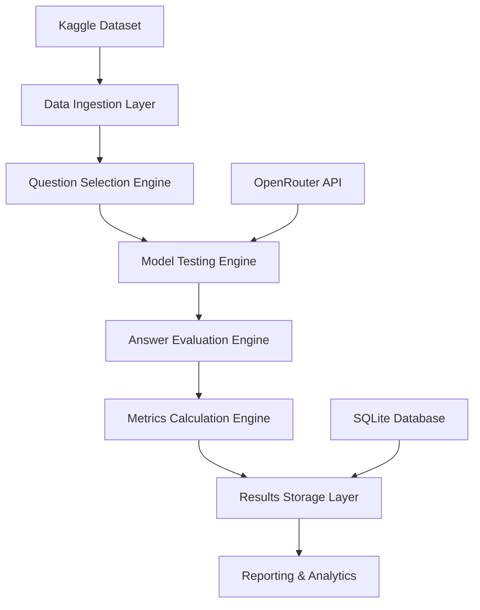
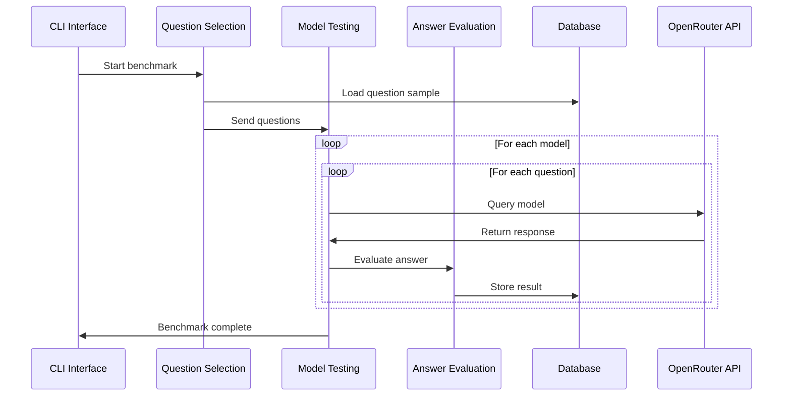

# Technical Specification: Language Model Benchmarking System

## 1. System Overview

The Language Model Benchmarking System is designed to evaluate multiple language models using Jeopardy questions from Kaggle, providing statistical analysis of model performance across various metrics.

### 1.1 High-Level Architecture



### 1.2 Core Components

1. **Data Ingestion Layer**: Loads and preprocesses Jeopardy dataset
2. **Question Selection Engine**: Implements statistical sampling for benchmark questions
3. **Model Testing Engine**: Interfaces with OpenRouter API to test language models
4. **Answer Evaluation Engine**: Performs fuzzy matching to grade model responses
5. **Metrics Calculation Engine**: Computes performance statistics
6. **Results Storage Layer**: Manages benchmark data persistence
7. **Reporting & Analytics**: Generates benchmark reports and visualizations

## 2. Data Architecture

### 2.1 Expected Jeopardy Dataset Schema

Based on typical Jeopardy datasets, the expected structure includes:
- `question`: Question text
- `answer`: Correct answer
- `category`: Jeopardy category
- `value`: Dollar value (difficulty indicator)
- `air_date`: Original broadcast date
- `show_number`: Episode identifier
- `round`: Jeopardy round (Jeopardy, Double Jeopardy, Final Jeopardy)

### 2.2 Database Schema

#### Tables

**benchmarks**
```sql
CREATE TABLE benchmarks (
    id INTEGER PRIMARY KEY AUTOINCREMENT,
    name VARCHAR(255) NOT NULL,
    description TEXT,
    created_at TIMESTAMP DEFAULT CURRENT_TIMESTAMP,
    question_count INTEGER NOT NULL,
    models_tested TEXT, -- JSON array of model names
    status VARCHAR(50) DEFAULT 'pending',
    completed_at TIMESTAMP
);
```

**benchmark_questions**
```sql
CREATE TABLE benchmark_questions (
    id INTEGER PRIMARY KEY AUTOINCREMENT,
    benchmark_id INTEGER NOT NULL,
    question_id VARCHAR(255) NOT NULL, -- From original dataset
    question_text TEXT NOT NULL,
    correct_answer TEXT NOT NULL,
    category VARCHAR(255),
    value INTEGER, -- Dollar value
    difficulty_level VARCHAR(50), -- Easy/Medium/Hard based on value
    FOREIGN KEY (benchmark_id) REFERENCES benchmarks(id)
);
```

**model_responses**
```sql
CREATE TABLE model_responses (
    id INTEGER PRIMARY KEY AUTOINCREMENT,
    benchmark_id INTEGER NOT NULL,
    question_id INTEGER NOT NULL,
    model_name VARCHAR(255) NOT NULL,
    response_text TEXT,
    response_time_ms INTEGER,
    tokens_generated INTEGER,
    cost_usd DECIMAL(10, 6),
    is_correct BOOLEAN,
    confidence_score DECIMAL(3, 2), -- 0.00 to 1.00
    created_at TIMESTAMP DEFAULT CURRENT_TIMESTAMP,
    FOREIGN KEY (benchmark_id) REFERENCES benchmarks(id),
    FOREIGN KEY (question_id) REFERENCES benchmark_questions(id)
);
```

**model_performance_summary**
```sql
CREATE TABLE model_performance_summary (
    id INTEGER PRIMARY KEY AUTOINCREMENT,
    benchmark_id INTEGER NOT NULL,
    model_name VARCHAR(255) NOT NULL,
    total_questions INTEGER,
    correct_answers INTEGER,
    accuracy_rate DECIMAL(5, 4),
    avg_response_time_ms DECIMAL(10, 2),
    total_cost_usd DECIMAL(10, 6),
    avg_tokens_per_second DECIMAL(10, 2),
    category_performance TEXT, -- JSON object with per-category stats
    difficulty_performance TEXT, -- JSON object with per-difficulty stats
    FOREIGN KEY (benchmark_id) REFERENCES benchmarks(id)
);
```

## 3. Statistical Sampling Algorithm

### 3.1 Sample Size Calculation

For statistical significance with 95% confidence level and 5% margin of error:

```
n = (Z²ₐ/₂ × p × (1-p)) / E²
```

Where:
- Z²ₐ/₂ = 1.96² for 95% confidence
- p = 0.5 (maximum variance assumption)
- E = 0.05 (5% margin of error)

Minimum sample size: n = 384 questions
Target sample size: 1000 questions (provides better statistical power)

### 3.2 Stratified Sampling Strategy

1. **Category Stratification**: Ensure proportional representation across Jeopardy categories
2. **Difficulty Stratification**: Sample across value ranges (Easy: $200-600, Medium: $800-1200, Hard: $1400-2000)
3. **Temporal Stratification**: Include questions from different eras if dataset spans multiple years

### 3.3 Selection Algorithm

```python
def select_benchmark_questions(dataset, sample_size=1000):
    # Stratify by category (maintain original distribution)
    category_distribution = get_category_distribution(dataset)
    
    # Stratify by difficulty
    difficulty_strata = {
        'Easy': dataset[dataset['value'] <= 600],
        'Medium': dataset[(dataset['value'] > 600) & (dataset['value'] <= 1200)],
        'Hard': dataset[dataset['value'] > 1200]
    }
    
    # Allocate samples proportionally
    selected_questions = []
    for difficulty, questions in difficulty_strata.items():
        stratum_size = int(sample_size * (len(questions) / len(dataset)))
        selected_questions.extend(
            questions.sample(n=stratum_size, random_state=42)
        )
    
    return selected_questions
```

## 4. Answer Evaluation Methodology

### 4.1 Fuzzy Matching Algorithm

Multi-level answer validation approach:

1. **Exact Match**: Direct string comparison (case-insensitive)
2. **Normalized Match**: Remove articles, punctuation, extra spaces
3. **Semantic Match**: Use string similarity metrics
4. **Format Flexibility**: Handle "What is..." format variations

### 4.2 Similarity Metrics

```python
def evaluate_answer(model_response, correct_answer):
    # Normalize both answers
    response_norm = normalize_answer(model_response)
    answer_norm = normalize_answer(correct_answer)
    
    # Multiple similarity checks
    exact_match = response_norm == answer_norm
    fuzzy_ratio = fuzz.ratio(response_norm, answer_norm)
    partial_ratio = fuzz.partial_ratio(response_norm, answer_norm)
    token_sort_ratio = fuzz.token_sort_ratio(response_norm, answer_norm)
    
    # Weighted scoring
    confidence_score = (
        exact_match * 1.0 +
        (fuzzy_ratio / 100) * 0.8 +
        (partial_ratio / 100) * 0.6 +
        (token_sort_ratio / 100) * 0.7
    ) / 3.1
    
    # Threshold for correctness (configurable)
    is_correct = confidence_score >= 0.7
    
    return is_correct, confidence_score
```

### 4.3 Special Cases

- **Person Names**: Handle common variations (first name only, last name only)
- **Geographic Locations**: Handle country/city variations
- **Dates**: Handle different date formats
- **Numbers**: Handle written vs numeric formats

## 5. Performance Metrics

### 5.1 Core Metrics

1. **Accuracy Rate**: `correct_answers / total_questions`
2. **Response Speed**: Average time per response in milliseconds
3. **Throughput**: Tokens per second
4. **Cost Efficiency**: Cost per correct answer
5. **Consistency**: Standard deviation of response times
6. **Category Performance**: Accuracy by Jeopardy category
7. **Difficulty Performance**: Accuracy by value range

### 5.2 Advanced Metrics

1. **Confidence-Accuracy Correlation**: How well model confidence predicts correctness
2. **Error Rate by Category**: Identify model weaknesses
3. **Cost-Performance Ratio**: Balance between cost and accuracy
4. **Latency Distribution**: P50, P95, P99 response times

### 5.3 Statistical Analysis

```python
def calculate_performance_metrics(responses):
    metrics = {
        'accuracy': len(responses[responses['is_correct']]) / len(responses),
        'avg_response_time': responses['response_time_ms'].mean(),
        'total_cost': responses['cost_usd'].sum(),
        'tokens_per_second': (responses['tokens_generated'] / 
                             (responses['response_time_ms'] / 1000)).mean(),
        'consistency': responses['response_time_ms'].std(),
        'cost_per_correct': (responses['cost_usd'].sum() / 
                           len(responses[responses['is_correct']])),
        'category_breakdown': get_category_performance(responses),
        'difficulty_breakdown': get_difficulty_performance(responses)
    }
    return metrics
```

## 6. API Integration Patterns

### 6.1 OpenRouter API Interface

```python
class OpenRouterClient:
    def __init__(self, api_key):
        self.api_key = api_key
        self.base_url = "https://openrouter.ai/api/v1"
    
    async def query_model(self, model_name, prompt, max_tokens=150):
        headers = {
            "Authorization": f"Bearer {self.api_key}",
            "Content-Type": "application/json"
        }
        
        payload = {
            "model": model_name,
            "messages": [{"role": "user", "content": prompt}],
            "max_tokens": max_tokens,
            "temperature": 0.1  # Low temperature for consistency
        }
        
        start_time = time.time()
        response = await self.session.post(
            f"{self.base_url}/chat/completions",
            headers=headers,
            json=payload
        )
        end_time = time.time()
        
        return {
            'response': response.json(),
            'response_time_ms': int((end_time - start_time) * 1000)
        }
```

### 6.2 Rate Limiting Strategy

- Implement exponential backoff for rate limits
- Concurrent request management with asyncio
- Queue-based processing for large benchmarks
- Model-specific rate limit handling

## 7. Data Flow Architecture

### 7.1 Benchmark Execution Flow



### 7.2 Error Handling

- Retry mechanisms for API failures
- Graceful degradation for partial results
- Comprehensive logging for debugging
- Recovery from interrupted benchmarks

## 8. Extensibility Considerations

### 8.1 New Model Support

- Abstract model interface for easy integration
- Plugin architecture for custom model adapters
- Configuration-driven model parameters

### 8.2 New Metrics

- Extensible metrics calculation framework
- Custom metric plugin system
- Configurable reporting templates

### 8.3 Web Interface Preparation

- RESTful API design for future web frontend
- WebSocket support for real-time benchmark progress
- Export capabilities (JSON, CSV, PDF reports)

## 9. Security & Configuration

### 9.1 API Key Management

- Environment variable configuration
- Secure credential storage
- API key rotation support

### 9.2 Configuration Management

- YAML/JSON configuration files
- Environment-specific settings
- Runtime parameter validation

## 10. Testing Strategy

### 10.1 Unit Testing

- Question selection algorithm validation
- Answer evaluation accuracy testing
- Metrics calculation verification

### 10.2 Integration Testing

- OpenRouter API integration
- Database operations
- End-to-end benchmark execution

### 10.3 Performance Testing

- Large dataset handling
- Concurrent model testing
- Memory usage optimization